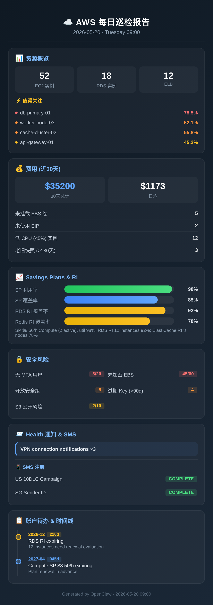

# 🛡️ AWS Patrol

**Automated AWS infrastructure monitoring skill for [OpenClaw](https://github.com/openclaw/openclaw)**

One command to get a complete daily health check of your AWS environment — resources, security posture, cost analysis, and a beautiful visual report card delivered to your chat.

## 📸 Report Preview

<p align="center">
  
</p>

## ✨ What It Does

| Category | Checks |
|----------|--------|
| 🖥️ **Resources** | EC2 CPU/status, RDS metrics, ELB target health, CloudWatch alarms |
| 🔒 **Security** | IAM MFA gaps, old access keys, open security groups, unencrypted EBS, public S3 |
| 💰 **Cost** | 30-day spend, daily trend, Savings Plans utilization & coverage, RDS/ElastiCache RI |
| 🗑️ **Waste** | Stopped instances, unattached volumes, unused EIPs, old snapshots, low-CPU instances |
| ⚕️ **Health** | AWS Health events, SMS/Pinpoint registration status |

## 📊 Report Includes

- **High CPU TOP 6** — instances/databases with highest utilization, color-coded by severity
- **SP/RI Coverage** — Savings Plans & Reserved Instance utilization at a glance
- **Security Score** — MFA, encryption, SG, access key age summary
- **Waste Detection** — unattached resources costing money for nothing
- **Action Timeline** — upcoming expirations and required actions with countdown

## 🚀 Quick Start

```bash
# Install the skill
cd ~/.astra/skills/
git clone https://github.com/chengcecho/aws-patrol

# Configure AWS credentials
export AWS_PATROL_PROFILE=your-readonly-profile
export AWS_PATROL_REGIONS=us-west-2,eu-west-1

# Step 1: Collect resource metrics
python3 scripts/patrol.py

# Step 2: Collect security & cost data
python3 scripts/patrol-security-cost.py

# Step 3: Generate visual report
python3 scripts/gen-report.py '{"date":"2026-05-20","weekday":"周二","ec2Count":90,...}'

# Step 4: Screenshot (optional, requires Puppeteer)
python3 -m http.server 18923 &
node -e "...puppeteer screenshot..."
```

## ⚙️ Configuration

| Environment Variable | Default | Description |
|---------------------|---------|-------------|
| `AWS_PATROL_PROFILE` | `AWS_PROFILE` or `default` | AWS CLI profile name |
| `AWS_PATROL_REGIONS` | `us-west-2,eu-west-2,ap-southeast-1` | Comma-separated regions to patrol |
| `AWS_PATROL_OUTPUT` | Current directory | Where to write JSON/HTML/PNG output |

## 📋 Requirements

- Python 3.8+ with `boto3`
- AWS IAM with `ReadOnlyAccess` policy
- Node.js + Puppeteer (for report screenshots, optional)

## 🤖 OpenClaw Automation

When used as an OpenClaw skill, set up daily cron for fully automated monitoring:

- Collects all data automatically
- Generates visual report card
- Screenshots and delivers to your chat
- **Investigates anomalies** — doesn't just report numbers, digs into root cause

### Example Schedule

```
每天 9:00 (周一到周五) → 全量巡检 + 异常深入排查
每周一 10:00 → 安全周报 (与上周对比)
```

## 🏗️ Architecture

```
patrol.py                → aws-patrol-detail.json (resources + health + SMS)
patrol-security-cost.py  → aws-security-cost.json (security + cost + SP/RI)
gen-report.py + template → daily-report.html → screenshot → deliver
```

## License

MIT
